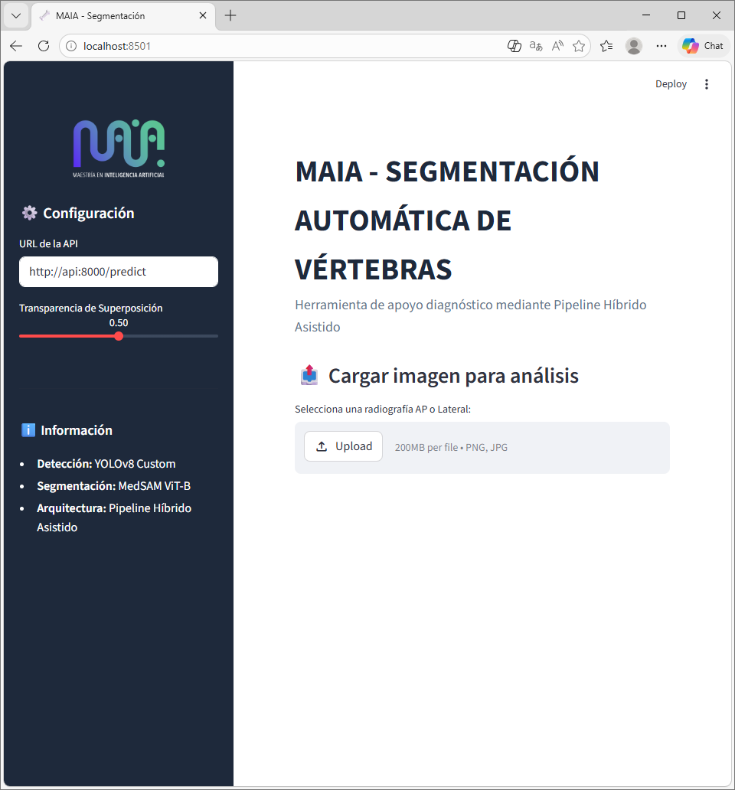
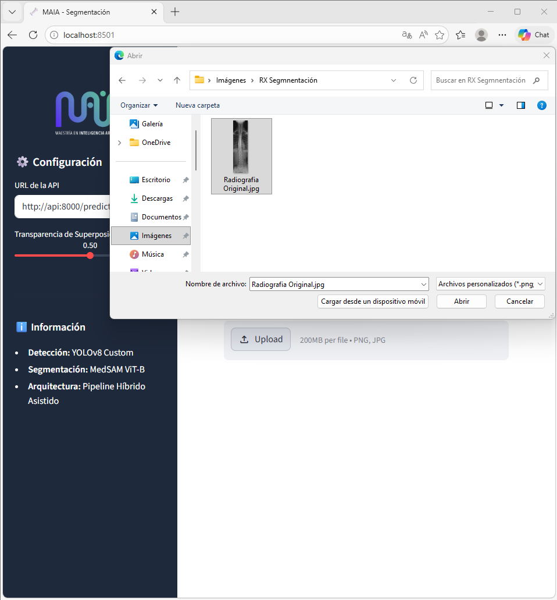
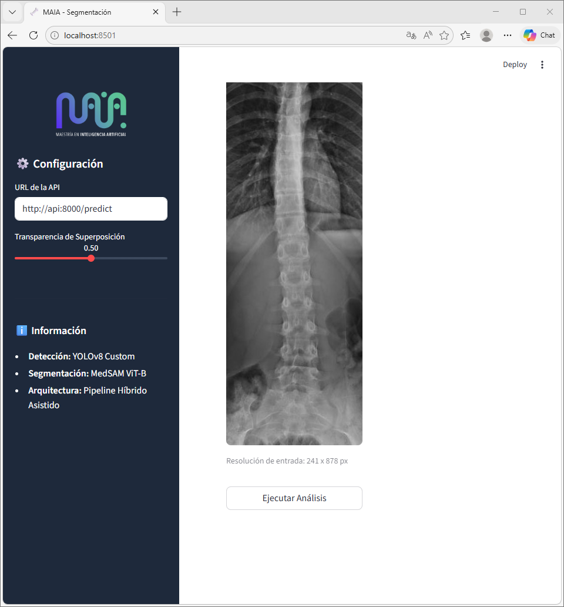
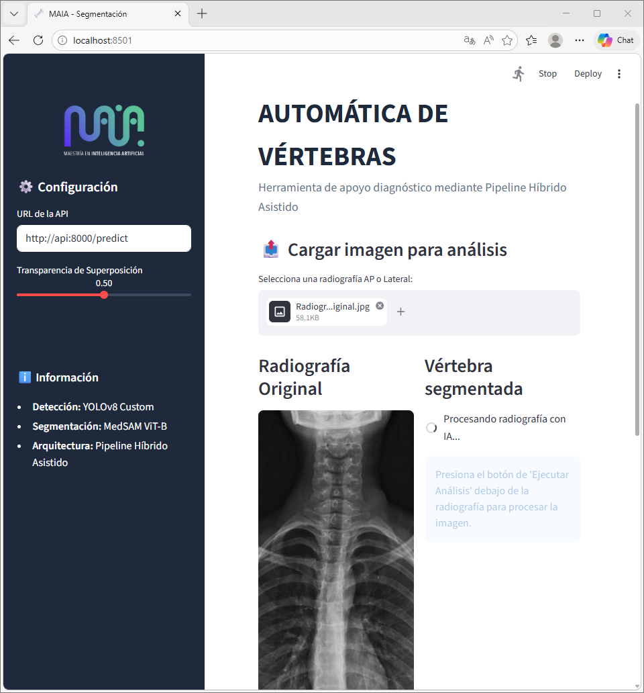
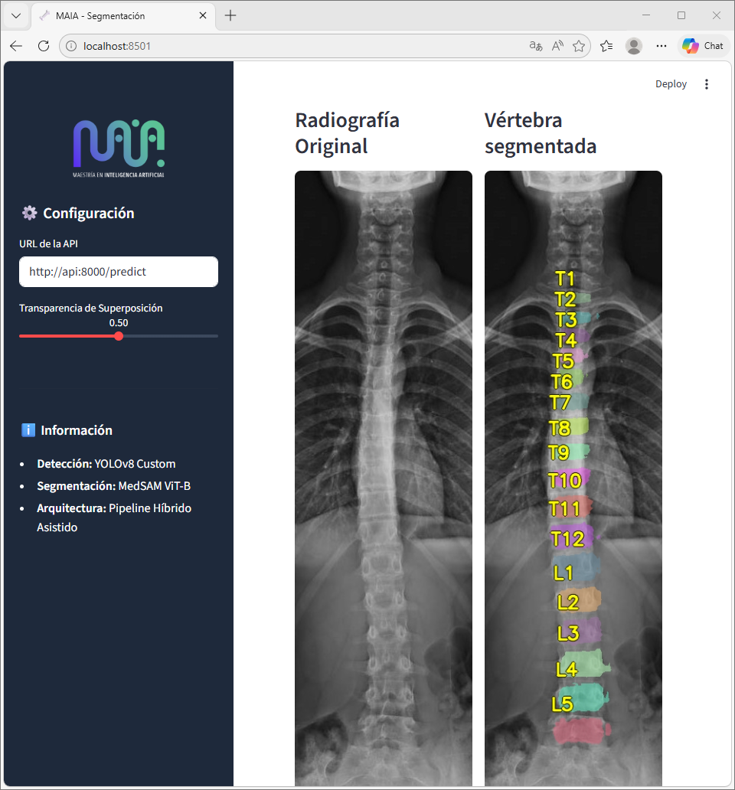
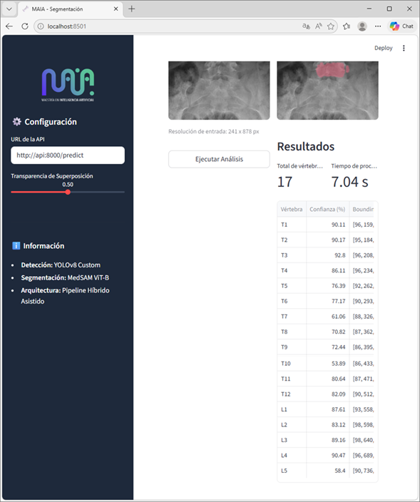

# MAIA — Segmentación de Vértebras en Radiografías de Columna

Sistema de segmentación multiclase de vértebras en radiografías de columna vertebral. Combina un detector YOLOv8 con un segmentador MedSAM fine-tuneado para identificar y delinear individualmente las vértebras T1–T12 y L1–L5, con soporte para columnas normales y casos de escoliosis.

- Diana Paola Rojas Castañeda
- Jorge Ivan Eslava Guzmán
- Patricio Romeo
- Juan Sebastian Vallarino Camacho
- Javier
---

## Arquitectura del sistema

```
Radiografía (JPEG/PNG)
        |
  [YOLOv8 Detector]         → bounding boxes por vértebra + confidence score
        |
  [MedSAM Segmentador]      → máscara de instancia por región propuesta
        |
  [Fusion Engine]           → imagen con overlay + tabla de resultados
        |
  FastAPI (backend)  ←→  Streamlit (frontend)
```

El pipeline es híbrido: YOLOv8 proporciona localización rápida y MedSAM (ViT-B fine-tuneado) genera la segmentación precisa de cada instancia.

---

## Dataset

| Atributo | Detalle |
|---|---|
| Total de imágenes | 250 radiografías |
| Normales | 71 (`N_*.jpg`) |
| Escoliosis | 179 (`S_*.jpg`) |
| Clases | 18 (background + T1–T12 + L1–L5) |
| Máscaras canónicas | `Scoliosis_Dataset/LabelMultiClass_ID_PNG/` — PNG 16-bit |
| Índice maestro | `Scoliosis_Dataset/indice_dataset.csv` |

El dataset **no está versionado en el repositorio** (incluido en `.gitignore`). Debe colocarse manualmente en `Scoliosis_Dataset/` siguiendo la estructura original.

---

## Estructura del repositorio

```
.
├── Scoliosis_Dataset/          # Dataset de radiografías (no versionado)
├── models/                     # Pesos del modelo entrenado (.pth)
├── notebooks/                  # Notebooks de experimentación y entrenamiento
├── old_notebooks/              # Versiones anteriores (archivo)
├── src/
│   ├── data/
│   │   └── preprocess.py       # Pipeline de preprocesamiento
│   └── inference/
│       └── predictor.py        # Motor de inferencia híbrido (YOLOv8 + MedSAM)
├── deployment/
│   ├── fastap_app/             # Backend FastAPI
│   │   ├── api.py
│   │   ├── Dockerfile
│   │   └── requirements.txt
│   └── front/                  # Frontend Streamlit
│       ├── app.py
│       ├── Dockerfile
│       └── requirements.txt
├── preprocesamiento.md         # Especificación del pipeline de preprocesamiento
├── procesamiento.md            # Especificación de entrenamiento
├── análisis.md                 # Análisis arquitectónico y decisiones de diseño
└── requirements.txt            # Dependencias base
```

---

## Requisitos del sistema

| Componente | Mínimo | Recomendado |
|---|---|---|
| Motor de contenedores | Docker Desktop (Win/Mac) o Docker Engine (Linux) | — |
| RAM | 4 GB | 8 GB (para fluidez en inferencia) |
| Conectividad | Acceso a internet para descarga inicial de imágenes Docker | — |
| Python | 3.11+ (solo para ejecución local sin Docker) | — |
| GPU / CUDA | Opcional | Recomendado para reducir latencia de inferencia |

### Dependencias principales

| Componente | Librería |
|---|---|
| Detección | `ultralytics` (YOLOv8) |
| Segmentación | `segment-anything` (SAM/MedSAM) |
| Backend | `fastapi`, `uvicorn` |
| Frontend | `streamlit` |
| Preprocesamiento | `opencv-python`, `albumentations`, `pillow` |
| Deep learning | `torch`, `torchvision` |

---

## Instalación local

```bash
# 1. Clonar el repositorio
git clone <url-del-repo>
cd segmentacion-vertebras-proyecto-maia

# 2. Crear entorno virtual
python -m venv .venv
.venv\Scripts\activate        # Windows
# source .venv/bin/activate   # Linux/Mac

# 3. Instalar dependencias del backend
pip install -r deployment/fastap_app/requirements.txt

# 4. Instalar segment-anything (MedSAM)
pip install git+https://github.com/facebookresearch/segment-anything.git

# 5. Colocar los pesos del modelo en models/
# El archivo esperado es: models/medsam_G_best_20260515_1500.pth
# (375MB — se distribuye por separado via Git LFS o enlace externo)
```

---

## Ejecución local (sin Docker)

### Backend (FastAPI)

```bash
# Desde la raíz del proyecto
set PYTHONPATH=.    # Windows
# export PYTHONPATH=.  # Linux/Mac

uvicorn deployment.fastap_app.api:app --host 0.0.0.0 --port 8000 --reload
```

La API queda disponible en `http://localhost:8000`.  
Documentación interactiva en `http://localhost:8000/docs`.

### Frontend (Streamlit)

```bash
# En otra terminal
pip install -r deployment/front/requirements.txt
streamlit run deployment/front/app.py
```

La interfaz queda disponible en `http://localhost:8501`.  
En la barra lateral, configurar el endpoint de la API como `http://localhost:8000`.

---

## Despliegue con Docker (recomendado)

El método oficial de despliegue usa una red virtual Docker para la comunicación interna entre backend y frontend.

**Paso 1 — Limpiar instancias previas** (evita conflictos de nombres y puertos):

```bash
docker rm -f api front
```

**Paso 2 — Crear la red virtual:**

```bash
docker network create maia-network
```

**Paso 3 — Construir las imágenes:**

```bash
# Backend (inferencia)
docker build -t vertebra-api:latest -f deployment/fastap_api/Dockerfile .

# Frontend (interfaz Streamlit)
docker build -t maia-front:latest -f deployment/front/Dockerfile .
```

> Asegurarse de que el nombre de la carpeta sea `fastap_api` (no `fastap_app`).

**Paso 4 — Lanzar los contenedores en la red compartida:**

```bash
# API en puerto 8000
docker run -d --name api -p 8000:8000 --network maia-network vertebra-api:latest

# Frontend en puerto 8501
docker run -d --name front -p 8501:8501 --network maia-network maia-front:latest
```

Acceder a la interfaz en `http://localhost:8501`.

> Para usar GPU dentro del contenedor, agregar `--gpus all` al `docker run` del backend.

---

## Endpoints de la API

| Método | Ruta | Descripción |
|---|---|---|
| `GET` | `/health` | Health check del servicio |
| `POST` | `/predict` | Recibe imagen (multipart), retorna JSON con imagen segmentada (base64), tabla de vértebras detectadas, confidence scores y bounding boxes |

### Ejemplo de uso con curl

```bash
curl -X POST http://localhost:8000/predict \
  -F "file=@radiografia.jpg" \
  | python -m json.tool
```

---

## Guía de uso de la interfaz

Una vez desplegada, acceder a `http://localhost:8501`.

---

### Paso 1 — Configuración inicial

Al abrir la aplicación se muestra la interfaz principal antes de cargar datos.



- **Panel de configuración (barra lateral izquierda):** verificar que la URL de la API apunte al contenedor de inferencia: `http://api:8000/predict`.
- **Transparencia de superposición (Alpha):** se recomienda iniciar en `0.50` para un equilibrio óptimo entre la máscara de IA y la anatomía real.
- **Información del sistema:** el panel inferior confirma el pipeline activo — detección con YOLOv8 Custom y segmentación con MedSAM ViT-B.

---

### Paso 2 — Carga de la radiografía

Presionar el botón **"Upload"** para abrir el explorador de archivos.



- **Formatos soportados:** `.jpg` y `.png`.
- Una vez seleccionado el archivo, la imagen se carga en el panel central y se muestra su resolución de entrada (ej. `241 × 878 px`) para confirmar que el archivo se leyó correctamente.

---

### Paso 3 — Ejecución del análisis

Presionar el botón **"Ejecutar Análisis"** para iniciar el pipeline.



El frontend se comunica con el backend y muestra un indicador de progreso mientras la IA procesa la radiografía.



> La latencia estimada es de **5 a 8 segundos** en entornos CPU (sujeto a la maquina donde esté desplegado). Durante este tiempo el pipeline detecta cada vértebra con YOLOv8 y genera su segmentación precisa con MedSAM.

---

### Paso 4 — Resultados visuales

Finalizado el análisis, la interfaz presenta una comparación lado a lado: radiografía original (izquierda) y radiografía segmentada (derecha).



Cada estructura ósea (T1 a L5) queda resaltada con un color distinto y etiquetada individualmente. Ajustar el slider de **Transparencia** en la barra lateral permite ver en tiempo real cómo la máscara se atenúa sobre la imagen original.

---

### Paso 5 — Tabla de resultados

En la parte inferior se despliega el panel de resultados numéricos.



- **Métricas globales:** total de vértebras detectadas y tiempo de procesamiento exacto.
- **Desglose por vértebra:**
  - **Confianza (%):** nivel de certeza del modelo en la identificación (ej. T1 con 90.11%).
  - **Bounding Box:** coordenadas espaciales `[x, y, w, h]` del área detectada por YOLOv8 antes de ser procesada por MedSAM.

---

## Notebooks de experimentación

Los notebooks en `notebooks/` documentan el proceso de desarrollo e incluyen:

| Notebook | Contenido |
|---|---|
| `medsam_ablation_*.ipynb` | Ablation study de MedSAM con distintos preprocesos y loss functions |
| `yolov8_*.ipynb` | Experimentos con YOLOv8 para detección de instancias |
| `maskrcnn_*.ipynb` | Experimentos con Mask R-CNN (ResNet50/101/EfficientNet) |
| `hybrid_yolov8_medsam_v1.ipynb` | Pipeline híbrido final |

Para ejecutar los notebooks, el dataset debe estar presente en `Scoliosis_Dataset/`.

---

## Pipeline de preprocesamiento

Ver [`preprocesamiento.md`](preprocesamiento.md) para la especificación completa. Resumen:

1. **Resize** a formato rectangular (512×1024) preservando relación de aspecto.
2. **Conversión a escala de grises** con conversión perceptual.
3. **ROI crop** usando la máscara binaria + margen ≥10%.
4. **CLAHE** para mejora de contraste local.
5. **Augmentation** sincronizada imagen-máscara (flip horizontal, rotación ±10°, deformación elástica).
6. **Normalización** z-score con stats de ImageNet.

---

## Entrenamiento

Ver [`procesamiento.md`](procesamiento.md) para la especificación completa.

El entrenamiento de los modelos sigue una estrategia de **descongelamiento progresivo** del encoder con **learning rates diferenciales por bloque**, usando una loss combinada `Dice + Focal` para manejar el desbalance de clases. Los notebooks de `notebooks/` contienen los runs de entrenamiento completos.

---

## Resolución de problemas (Troubleshooting)

| Problema | Causa probable | Solución |
|---|---|---|
| Error de conexión | El contenedor `api` no está iniciado o no está en la red | Ejecutar `docker ps` y verificar que ambos contenedores estén en `maia-network` |
| Lentitud extrema | Recursos de RAM limitados en Docker Desktop | Aumentar la asignación de RAM en la configuración de Docker Desktop (>4 GB) |
| Imagen no procesada | Formato incompatible o archivo corrupto | Usar formatos estándar `.png` o `.jpg` |

---

## Hardware de referencia (entrenamiento)

| Componente | Especificación |
|---|---|
| GPU | NVIDIA GeForce GTX 1650 (4 GB VRAM) |
| CPU | AMD Ryzen 5 5600X @ 3.70 GHz |
| RAM | 16 GB |

La inferencia en CPU es funcional pero significativamente más lenta. Para reentrenar se recomienda mínimo 8 GB VRAM.

